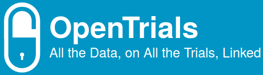
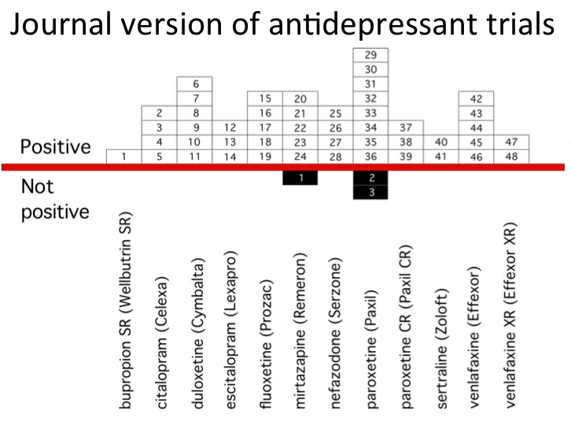
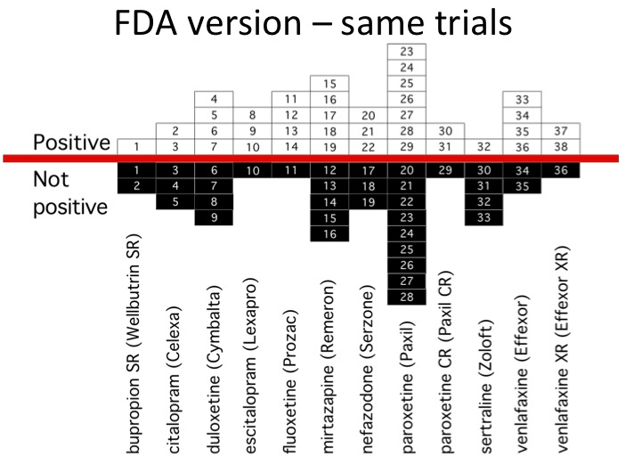

class: center, middle, inverse

.footnote[Vitor Baptista]

.footnote[vitor.baptista@okfn.org]

---

layout: true
class: center, middle

---

# What are clinical trials?

---

# Let me tell you a story

---

# TGN1412 (a.k.a the Elephant Man trial)

---

# March 2006 in London

---

# Six volunteers paid 2,000 pounds each

---

# In the first hour

---

# Headaches

---

# Muscle aches

---

# Feeling of unease

---

# After some time...

---

# High temperatures

---

# Restlessness

---

# Forgot who and where they were

---

# Shivering

---

# Flushing

---

# Pulse racing

---

# Falling blood pressure

---

# One went into respiratory failure

---

# Another dropped his blood pressure and stopped breathing properly

---

# Went to intensive care

---

# Within a day all were disastrously unwell

---

# Ventilated on intensive care

---

# ... and other bad things

---

# Thankfully, with heroic effort, all escaped

---

# Could this have been prevented?

---

# Yes

---

# Previous study with a similar intervention

---

# Conducted **10 years** before

---

# Unpublished

---

# FDA: US Food and Drug Administration
---

---

---

# This is changing

---

class: fit-background-img
background-image: url(img/alltrials.png)

---

# United Nations calls for global action
## 14/Set/2016

.footnote[http://www.alltrials.net/news/un-calls-for-global-action-on-clinical-trial-transparency/]

---

# Back to OpenTrials

---

# World Health Organisation Primary Registries
## 15 (so far...)

---

# Discrepancies

---

# Our challenges

---

# Collecting data

---

# Normalizing data

---

United Kingdom

--

UK

--

Wales

--

England

--

Scotland

--

North Ireland

--

... different languages

---

# Deduplication

---

# Scanned PDFs

---

# I'm convinced! How can I help?

* Data science
* Web development (Node)
* Scrapers
* Writing documentation and tutorials
* Spread the word

---

# Play with the data!

Let us know what you find.

---

# OpenTrials Hack Day

Berlin @ Wikimedia Deutschland - 8/Set/2016

https://www.eventbrite.com/e/opentrials-hack-day-tickets-27046834811

---

# Thank you!

http://opentrials.net

http://explorer.opentrials.net

https://github.com/opentrials

https://gitter.im/opentrials/chat

vitor.baptista@okfn.org

---

layout: false

# References

* [OpenTrials](http://opentrials.net)
* [AllTrials](http://alltrials.net)
* [Bad Science](http://www.badscience.net/)
* [TED Talk: Battling bad science](http://www.ted.com/talks/ben_goldacre_battling_bad_science)
* [Selective Publication of Antidepressant Trials and its influence on Apparent Efficacy](http://www.nejm.org/doi/full/10.1056/NEJMsa065779)
* [WHO Primary Registries](http://www.who.int/ictrp/network/primary/en/)
